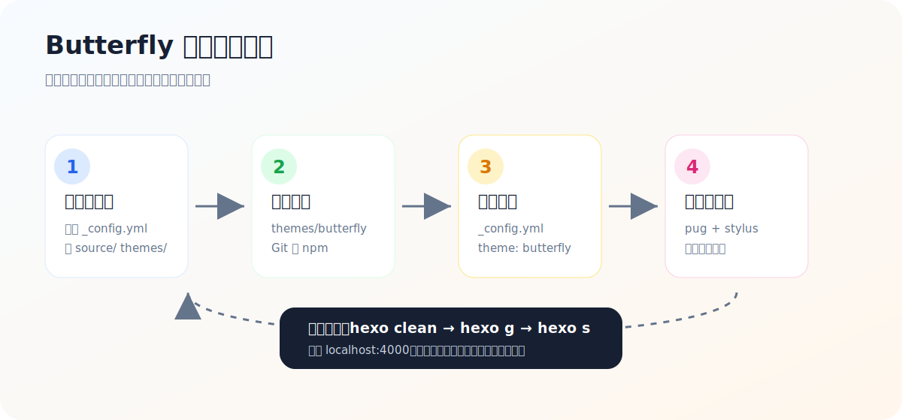
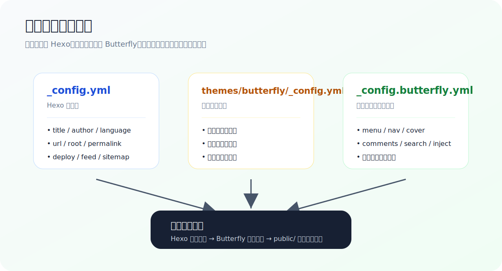

# 01 主题下载与切换：把默认 Hexo 换成 Butterfly

这一节我们把默认的 Hexo 博客换成 Butterfly 主题。它不是单纯“换个皮肤”，而是把首页卡片、导航栏、文章页目录、搜索、评论、暗色模式、代码块样式等一整套博客体验接进来。

> [!TIP]
> 本文里的命令都在 **你的 Hexo 博客根目录** 执行，例如 `D:\Hexo-Blog\blog-demo`。不要在教程仓库 `hello-hexo-blog` 根目录里执行主题安装命令。



## 这一节你会学到什么

1. 选择适合自己的 Butterfly 安装方式。
2. 在 `_config.yml` 中切换主题。
3. 安装 Butterfly 必需的渲染器。
4. 建立 `_config.butterfly.yml`，把主题配置从主题源码中分离出来。
5. 用 `hexo clean`、`hexo generate`、`hexo server` 验证切换结果。
6. 处理第一次切换主题时最常见的报错。

---

## 1. 先确认你站在正确目录

打开终端后，先进入 Hexo 博客根目录：

```bash
cd "D:\Hexo-Blog\blog-demo"
```

这个目录通常应该长这样：

```text
blog-demo/
├── _config.yml
├── package.json
├── scaffolds/
├── source/
├── themes/
└── node_modules/          # npm install 后出现
```

如果你看不到 `_config.yml`，说明你很可能还没有进入 Hexo 根目录。先回到第 3 章完成 Hexo 初始化，再继续本节。

> [!NOTE]
> Hexo 的主题文件放在 `themes/` 里；你写的文章放在 `source/_posts/` 里；生成出来的网站在 `public/` 里。三者不要混在一起。

---

## 2. 选择安装方式

Butterfly 常见安装方式有两种：Git 安装和 npm 安装。

| 方式 | 适合人群 | 优点 | 注意点 |
| --- | --- | --- | --- |
| Git 安装 | 初学者、想直接看到主题文件的人 | 主题会出现在 `themes/butterfly`，路径直观 | 升级时进入主题目录执行 `git pull` |
| npm 安装 | 已熟悉 npm、想让主题跟依赖统一管理的人 | 升级可用 `npm update` | 主题文件在 `node_modules`，不适合直接翻改源码 |

本教程推荐先用 Git 安装，因为它更容易理解“主题文件夹”这件事。

### 方式 A：GitHub 稳定版

```bash
git clone -b master https://github.com/jerryc127/hexo-theme-butterfly.git themes/butterfly
```

执行完成后检查：

```bash
dir themes\butterfly
```

你应该能看到主题自带的 `_config.yml`、`layout/`、`source/` 等文件。

### 方式 B：Gitee 稳定版

如果 GitHub 下载不稳定，可以换成 Gitee 镜像：

```bash
git clone -b master https://gitee.com/immyw/hexo-theme-butterfly.git themes/butterfly
```

### 方式 C：npm 安装

如果你使用 Hexo 5 及以上，也可以安装 npm 包：

```bash
npm install hexo-theme-butterfly --save
```

npm 安装后不会在 `themes/` 下生成完整主题目录，这是正常现象。

---

## 3. 切换主题

打开 Hexo 根目录下的 `_config.yml`，找到 `theme`：

```yaml
theme: landscape
```

改成：

```yaml
theme: butterfly
```

这里的 `butterfly` 要和主题目录名一致。如果你把主题目录命名成 `Butterfly`，Windows 下可能暂时看不出问题，但部署到 Linux 环境后容易出现大小写路径问题，因此建议统一使用小写。

---

## 4. 安装 Butterfly 必需渲染器

Butterfly 使用 Pug 和 Stylus。如果缺少渲染器，页面可能直接显示一串 `extends includes/layout.pug` 之类的源码。

在 Hexo 根目录执行：

```bash
npm install hexo-renderer-pug hexo-renderer-stylus --save
```

安装后可以看一下 `package.json`，确认依赖已经出现：

```json
{
  "dependencies": {
    "hexo-renderer-pug": "...",
    "hexo-renderer-stylus": "..."
  }
}
```

> [!WARNING]
> 如果你已经安装了很多 Markdown 渲染器，暂时不要随便卸载。先保证 Butterfly 能跑起来，再处理公式、代码高亮等进阶问题。

---

## 5. 建立独立主题配置文件

官方文档推荐在 Hexo 根目录创建 `_config.butterfly.yml`，把主题目录里的配置复制过去：

```bash
copy themes\butterfly\_config.yml _config.butterfly.yml
```

这样做有两个好处：

1. 升级主题时，不会把你的个性化配置直接覆盖掉。
2. 主题默认配置和你的自定义配置分开，后续排查更清楚。



配置优先级可以理解成：

```text
主题默认配置 themes/butterfly/_config.yml
        +
你的覆盖配置 _config.butterfly.yml
        ↓
最终渲染出来的 Butterfly 站点
```

如果两个文件里出现同名配置，通常以根目录 `_config.butterfly.yml` 为准。因此以后优先改根目录下的 `_config.butterfly.yml`，不要一上来就改 `themes/butterfly/_config.yml`。

---

## 6. 第一次本地预览

执行下面四条命令：

```bash
npm install
npx hexo clean
npx hexo generate
npx hexo server
```

然后打开：

```text
http://localhost:4000/
```

你应该能看到 Butterfly 的首页布局，而不是 Hexo 默认的 Landscape 样式。

如果你之前已经启动过 Hexo 服务，终端里可能提示端口被占用。可以先按 `Ctrl + C` 停掉旧服务，或者换端口：

```bash
npx hexo server -p 4001
```

---

## 7. 主题升级方式

### Git 安装的升级

进入主题目录：

```bash
cd themes\butterfly
git pull
```

回到博客根目录后重新生成：

```bash
cd ..\..
npx hexo clean
npx hexo generate
```

### npm 安装的升级

在 Hexo 根目录执行：

```bash
npm update hexo-theme-butterfly
```

升级后建议去 Butterfly 的更新日志看一眼是否有配置项变化。尤其是大版本升级时，最好把新的主题 `_config.yml` 和自己的 `_config.butterfly.yml` 对比一下。

---

## 8. 常见问题排查

| 现象 | 可能原因 | 处理方法 |
| --- | --- | --- |
| 页面直接显示 Pug 源码 | 缺少 Pug/Stylus 渲染器 | 执行 `npm install hexo-renderer-pug hexo-renderer-stylus --save` |
| 还是默认 Landscape 主题 | `_config.yml` 没改对，或服务没重启 | 确认 `theme: butterfly`，执行 `hexo clean` 后重启 |
| 主题目录为空或不完整 | clone 中断 | 删除 `themes/butterfly` 后重新 clone |
| 图片、CSS 404 | `root`、`url` 或资源路径不匹配 | 先用本地 `localhost:4000` 排查，再检查部署路径 |
| 修改配置没生效 | 改错文件，或缓存未清理 | 优先改 `_config.butterfly.yml`，然后 `hexo clean` |
| 部署后本地正常、线上异常 | GitHub Pages 路径、缓存或构建环境不同 | 检查仓库 Pages 设置、Node 版本和构建日志 |

---

## 9. 推荐目录整理方式

为了后续美化方便，建议你在 Hexo 根目录下提前规划资源目录：

```text
source/
├── img/                  # 头像、封面、背景图
├── css/                  # 自定义样式
│   └── custom.css
├── js/                   # 自定义脚本
│   └── custom.js
├── about/
├── tags/
├── categories/
└── _posts/
```

后面引用图片时可以写成：

```yaml
avatar:
  img: /img/avatar.png
```

如果你的站点部署在子路径，例如 `https://example.com/blog/`，就要留意根路径配置，避免本地正常、线上图片失效。

---

## 10. 本节练习

请你按顺序完成：

1. 进入自己的 Hexo 根目录。
2. 安装 Butterfly 主题。
3. 把 `_config.yml` 中的 `theme` 改成 `butterfly`。
4. 安装 `hexo-renderer-pug` 和 `hexo-renderer-stylus`。
5. 创建 `_config.butterfly.yml`。
6. 本地启动并截图保存首页效果。

完成后，你的博客已经从“能运行”进入“能美化”的阶段。下一节我们会开始调整导航栏、首页副标题、封面、文章卡片和评论搜索入口。

---

## 参考资料

- [Butterfly 文档：快速开始](https://butterfly.js.org/posts/21cfbf15/)
- [hexo-theme-butterfly npm 页面](https://www.npmjs.com/package/hexo-theme-butterfly)
- [Hexo 官方文档：Setup](https://hexo.io/docs/setup)
- [Butterfly 主题美化教程：从零开始](https://butterfly.zhheo.com/create.html)
