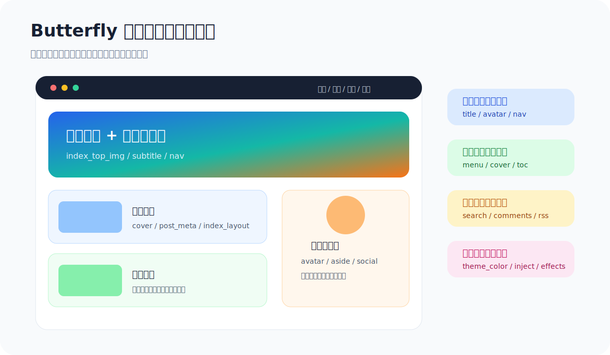

# 02 Butterfly 配置指南：从能用到好看

上一节完成主题安装后，博客已经换成 Butterfly。接下来这一节重点不是“把所有配置项都背下来”，而是建立一条稳定的美化顺序：先做站点信息和导航，再做首页视觉，再做文章页阅读体验，最后接评论和搜索。



## 这一节你会学到什么

1. 区分 Hexo 站点配置和 Butterfly 主题配置。
2. 配置站点标题、作者、语言、时区等基础信息。
3. 调整导航栏、首页大图、副标题和菜单图标。
4. 设置文章封面、文章卡片、目录和侧边栏。
5. 建立“每改一块就验证一次”的配置习惯。

---

## 1. 先分清两个配置文件

Butterfly 初学者最容易卡在“到底改哪个配置文件”。先记住这张关系图：


| 文件 | 位置 | 主要负责 | 修改频率 |
| --- | --- | --- | --- |
| `_config.yml` | Hexo 根目录 | 站点标题、作者、语言、URL、永久链接、部署 | 中 |
| `_config.butterfly.yml` | Hexo 根目录 | 导航、首页、封面、侧边栏、评论、搜索、特效 | 高 |
| `themes/butterfly/_config.yml` | 主题目录 | 主题默认配置 | 低，尽量不直接改 |

> [!TIP]
> 以后看到教程说“修改主题配置文件”，优先理解为修改 Hexo 根目录下的 `_config.butterfly.yml`。

---

## 2. 配置站点基础信息

打开 Hexo 根目录下的 `_config.yml`，先补齐这些信息：

```yaml
title: Weyumm 的博客
subtitle: 记录技术、学习与生活
description: 一个用 Hexo 和 Butterfly 搭建的个人博客
keywords: Hexo, Butterfly, Blog, Markdown
author: Weyumm
language: zh-CN
timezone: Asia/Shanghai
url: https://你的用户名.github.io
root: /
```

这些字段会影响：

- 浏览器标签页标题。
- 首页、作者卡片和 SEO 描述。
- RSS、站点地图、评论系统回调地址。
- 部署到 GitHub Pages 后的资源路径。

如果你部署到项目页，例如 `https://用户名.github.io/blog/`，通常要把 `root` 设置成 `/blog/`。如果是用户主页仓库 `用户名.github.io`，一般保持 `/`。

---

## 3. 配置导航栏

导航栏决定读者进入网站后先看到哪些入口。打开 `_config.butterfly.yml`，找到 `nav` 和 `menu`。

```yaml
nav:
  logo: /img/logo.png
  display_title: true
  display_post_title: true
  fixed: false

menu:
  首页: / || fas fa-home
  归档: /archives/ || fas fa-archive
  标签: /tags/ || fas fa-tags
  分类: /categories/ || fas fa-folder-open
  友链: /link/ || fas fa-link
  关于: /about/ || fas fa-heart
```

菜单格式可以拆成三段：

```text
显示名称: 链接路径 || 图标类名
```

常用图标来自 Font Awesome。比如：

| 菜单 | 推荐图标 | 说明 |
| --- | --- | --- |
| 首页 | `fas fa-home` | 回到首页 |
| 归档 | `fas fa-archive` | 按时间浏览文章 |
| 标签 | `fas fa-tags` | 按关键词浏览 |
| 分类 | `fas fa-folder-open` | 按主题浏览 |
| 友链 | `fas fa-link` | 交换链接页 |
| 关于 | `fas fa-heart` | 个人介绍页 |

如果你想做二级菜单，可以这样写：

```yaml
menu:
  首页: / || fas fa-home
  学习笔记||fas fa-book:
    Hexo: /categories/Hexo/ || fas fa-feather
    前端: /categories/前端/ || fas fa-code
  工具箱||fas fa-toolbox||hide:
    导航: /nav/ || fas fa-compass
    资源: /resources/ || fas fa-box-open
```

`hide` 常用于移动端，让子菜单默认折叠，避免手机导航过长。

---

## 4. 创建导航对应页面

如果菜单里有 `tags`、`categories`、`link`、`about`，就要确保这些页面真的存在。

```bash
npx hexo new page tags
npx hexo new page categories
npx hexo new page link
npx hexo new page about
```

然后分别修改生成的 `source/*/index.md`。

标签页：

```md
---
title: 标签
date: 2026-05-01
type: tags
---
```

分类页：

```md
---
title: 分类
date: 2026-05-01
type: categories
---
```

关于页可以正常写 Markdown 内容：

```md
---
title: 关于我
date: 2026-05-01
type: about
---

你好，这里是我的个人博客。
```

---

## 5. 调整首页视觉

首页主要看三块：顶部图、打字副标题、文章卡片。

```yaml
index_top_img: /img/home-bg.webp
index_top_img_height: 36vh

subtitle:
  enable: true
  effect: true
  typed_option:
    loop: true
    typeSpeed: 80
    backSpeed: 40
  sub:
    - 记录每一次动手的过程
    - 把知识写成能复用的路径
    - Stay curious, keep building
```

图片建议：

| 图片类型 | 推荐尺寸 | 用途 |
| --- | --- | --- |
| 首页顶部图 | 1920 x 800 或更宽 | 第一眼氛围 |
| 头像 | 400 x 400 | 侧边栏作者卡片 |
| 文章封面 | 1200 x 675 | 首页卡片与文章页封面 |
| 背景纹理 | 小体积 webp/png | 页面背景，不宜太花 |

> [!WARNING]
> 不建议把图片放在 `themes/butterfly/source/` 下。主题升级时可能被覆盖。更稳妥的做法是放在 Hexo 根目录的 `source/img/`，然后用 `/img/xxx.webp` 引用。

---

## 6. 设置头像和作者卡片

作者卡片是 Butterfly 的重要识别区域。可以先保持简洁：

```yaml
avatar:
  img: /img/avatar.png
  effect: false

social:
  fab fa-github: https://github.com/你的用户名 || Github
  fas fa-envelope: mailto:you@example.com || Email
```

如果头像加载失败，优先检查：

1. 图片是否放在 `source/img/avatar.png`。
2. 文件名大小写是否一致。
3. 部署站点是否有子路径，例如 `/blog/img/avatar.png`。

---

## 7. 让文章卡片更有信息密度

首页文章卡片不要只追求“炫”，要让读者快速判断文章值不值得点开。

```yaml
index_layout: 3
index_post_content:
  method: 3
  length: 160

post_meta:
  page:
    date_type: created
    date_format: date
    categories: true
    tags: true
    label: true
  post:
    position: left
    date_type: both
    date_format: date
    categories: true
    tags: true
    label: true
```

常见选择：

| 配置 | 推荐值 | 效果 |
| --- | --- | --- |
| `index_layout` | `3` 或 `4` | 文章封面与信息更均衡 |
| `index_post_content.length` | `120` 到 `200` | 摘要不至于太长 |
| `post_meta.post.date_type` | `both` | 显示创建和更新信息 |
| `post_meta.page.tags` | `true` | 首页卡片显示标签 |

---

## 8. 配置文章封面

文章封面有三层来源：

```text
文章 Front-matter 的 cover
        ↓ 如果没有
_config.butterfly.yml 的 default_cover
        ↓ 如果没有
不显示封面或显示默认样式
```

在主题配置中打开封面：

```yaml
cover:
  index_enable: true
  aside_enable: true
  archives_enable: true
  position: both
  default_cover:
    - /img/covers/cover-01.webp
    - /img/covers/cover-02.webp
    - /img/covers/cover-03.webp
```

单篇文章可以这样写：

```md
---
title: 我的第一篇 Butterfly 文章
date: 2026-05-01
categories: Hexo
tags:
  - Butterfly
  - 博客搭建
cover: /img/covers/hexo-butterfly.webp
---
```

> [!TIP]
> 封面图尽量保持比例统一。否则首页卡片会忽高忽低，看起来不够整齐。

---

## 9. 调整文章页阅读体验

文章页重点是阅读，不是堆满小组件。建议先配置目录、版权、上一篇下一篇。

```yaml
toc:
  post: true
  page: false
  number: true
  expand: false
  style_simple: false

post_copyright:
  enable: true
  decode: true
  author_href:
  license: CC BY-NC-SA 4.0
  license_url: https://creativecommons.org/licenses/by-nc-sa/4.0/

post_pagination: true
```

如果你的文章很长，目录很有用。如果你的页面是“关于我”或“友链”，可以在 Front-matter 中关闭侧边栏：

```md
---
title: 关于我
aside: false
---
```

---

## 10. 侧边栏不要一次开太多

侧边栏适合承载作者卡片、公告、最新文章、分类、标签、归档等信息，但初期不建议全开。

```yaml
aside:
  enable: true
  hide: false
  button: true
  mobile: true
  position: right
  display:
    archive: true
    tag: true
    category: true
  card_author:
    enable: true
  card_announcement:
    enable: true
    content: 欢迎来到我的博客。
  card_recent_post:
    enable: true
  card_categories:
    enable: true
  card_tags:
    enable: true
  card_archives:
    enable: false
```

建议顺序：

1. 先开作者卡片和公告。
2. 再开最新文章。
3. 文章数量多了再开分类、标签、归档。
4. 手机端检查是否太拥挤。

---

## 11. 搜索和评论先做入口，不急着全配完

搜索和评论会在下一节详细讲。这里先留好位置：

```yaml
search:
  use:
  placeholder: 搜索文章

comments:
  use:
  text: true
  lazyload: false
  count: false
  card_post_count: false
```

先保持空值，确保主题其它部分稳定。等首页、文章页、侧边栏都正常后，再接入搜索和评论系统。

---

## 12. 推荐的配置顺序

| 阶段 | 先改什么 | 验证方式 |
| --- | --- | --- |
| 第一轮 | `title`、`author`、`language`、`theme` | 首页标题和语言正常 |
| 第二轮 | `menu`、`nav`、页面类型 | 每个导航入口都能打开 |
| 第三轮 | `index_top_img`、`subtitle`、`avatar` | 首页视觉完整 |
| 第四轮 | `cover`、`post_meta`、`toc` | 文章卡片和文章页信息正常 |
| 第五轮 | `search`、`comments`、`inject` | 功能可用，控制台无明显错误 |

每改完一轮都执行：

```bash
npx hexo clean
npx hexo generate
npx hexo server
```

---

## 13. 一份适合新手的最小配置

如果你不知道从哪里开始，可以先把下面这份作为起点：

```yaml
nav:
  display_title: true
  display_post_title: true
  fixed: false

menu:
  首页: / || fas fa-home
  归档: /archives/ || fas fa-archive
  标签: /tags/ || fas fa-tags
  分类: /categories/ || fas fa-folder-open
  友链: /link/ || fas fa-link
  关于: /about/ || fas fa-heart

index_top_img: /img/home-bg.webp
index_top_img_height: 36vh

subtitle:
  enable: true
  effect: true
  sub:
    - 记录每一次动手的过程
    - 把知识写成能复用的路径

avatar:
  img: /img/avatar.png
  effect: false

cover:
  index_enable: true
  aside_enable: true
  archives_enable: true
  position: both
  default_cover:
    - /img/covers/default-01.webp
    - /img/covers/default-02.webp

aside:
  enable: true
  position: right
  card_author:
    enable: true
  card_announcement:
    enable: true
    content: 欢迎来到我的博客。
```

---

## 14. 本节练习

请你完成下面 5 件事：

1. 把站点标题、作者、语言、时区改成自己的信息。
2. 建立 `首页 / 归档 / 标签 / 分类 / 友链 / 关于` 六个导航入口。
3. 给首页设置一张 `index_top_img`。
4. 给头像和文章默认封面准备本地图片。
5. 启动本地预览，分别检查首页、文章页和移动端导航。

如果这 5 件事都完成了，你的 Butterfly 站点就已经有“个人博客”的基本样子了。

---

## 参考资料

- [Butterfly 文档：主题配置](https://butterfly.js.org/posts/4aa8abbe/)
- [Xdog：butterfly 主题配置示例](https://blog.xdog.top/posts/1122109805/index.html)
- [Butterfly 主题美化教程：从零开始](https://butterfly.zhheo.com/create.html)
