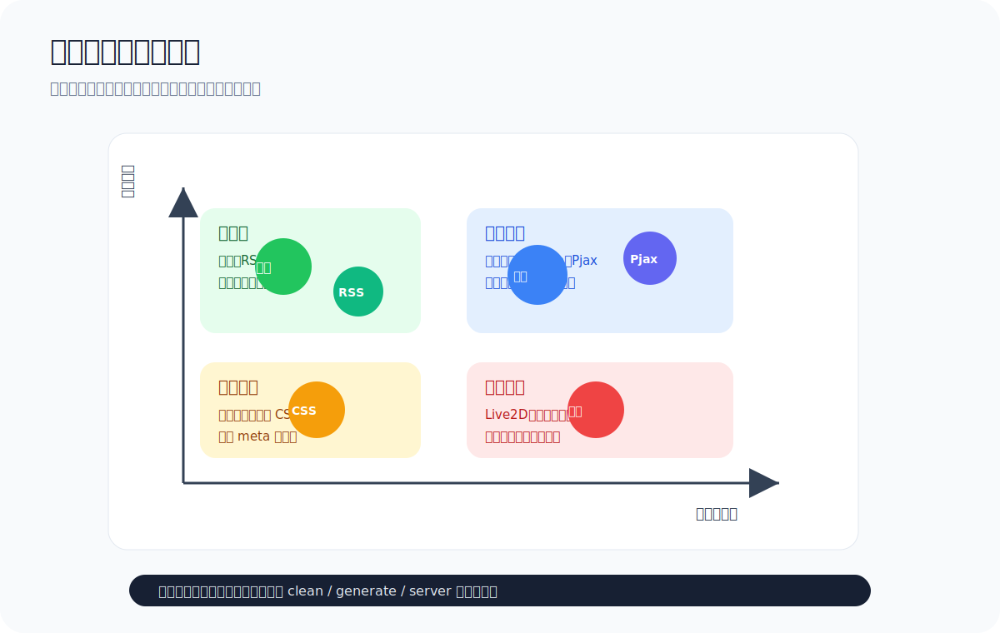
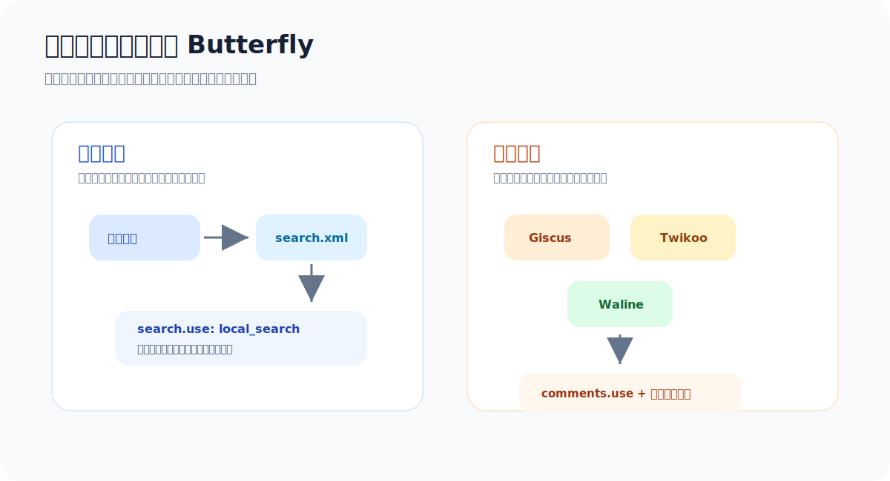
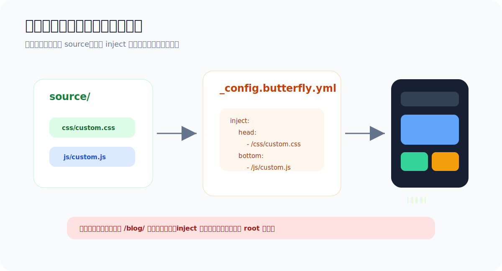

# 03 常用功能扩展：搜索、评论、动效与自定义美化

前两节已经完成主题安装和核心配置。这一节继续往上加功能，但原则很简单：**先补真正有用的能力，再加锦上添花的动效。** 搜索、评论、RSS、站点地图、代码块、封面和自定义 CSS/JS，都是能明显提升博客体验的扩展。



## 这一节你会学到什么

1. 判断哪些插件是必装、选装或暂时不用。
2. 配置本地搜索，让读者能快速找到文章。
3. 选择 Giscus、Twikoo、Waline 等评论方案。
4. 用 `inject` 引入自定义 CSS/JS，而不是直接改主题源码。
5. 配置 RSS、站点地图和 GitHub Pages 部署检查。
6. 建立扩展功能的排障顺序。

---

## 1. 扩展功能不要一次全开

Butterfly 支持的功能很多，但新手最常见的问题是：看见一个教程就复制一段配置，最后页面坏了却不知道是哪一段导致的。

更稳的顺序是：

```text
基础渲染器
  ↓
搜索 / RSS / Sitemap
  ↓
评论系统
  ↓
文章体验增强
  ↓
自定义 CSS / JS
  ↓
动效和装饰组件
```

每次只加一类功能，生成一次，预览一次。

---

## 2. 插件选择表

| 插件 | 用途 | 推荐程度 | 备注 |
| --- | --- | --- | --- |
| `hexo-renderer-pug` | 渲染 Butterfly 模板 | 必装 | 缺少时页面会显示 Pug 源码 |
| `hexo-renderer-stylus` | 渲染主题样式 | 必装 | Butterfly 样式依赖 |
| `hexo-deployer-git` | 部署到 GitHub Pages | 必装或常用 | 第 3 章部署会用到 |
| `hexo-generator-searchdb` | 生成本地搜索数据库 | 推荐 | 配合 `local_search` |
| `hexo-generator-search` | 生成 `search.xml` | 推荐 | 二选一即可，按主题配置匹配 |
| `hexo-generator-feed` | RSS/Atom 订阅 | 推荐 | 适合长期写博客 |
| `hexo-generator-sitemap` | 生成站点地图 | 推荐 | 便于搜索引擎收录 |
| `hexo-generator-baidu-sitemap` | 百度站点地图 | 选装 | 面向百度收录 |
| `hexo-abbrlink` | 生成短链接 | 选装 | 适合不想让 URL 出现中文标题的人 |
| `hexo-wordcount` | 字数统计、阅读时长 | 选装 | Butterfly 可显示阅读信息 |
| `hexo-helper-live2d` | 看板娘 | 谨慎 | 有趣但会增加资源体积 |
| `hexo-bilibili-bangumi` | 追番页面 | 选装 | 适合个人兴趣页 |

> [!TIP]
> `package.json` 里插件越多，构建越慢、排障越复杂。初期保留“真正会用”的插件就好。

---

## 3. 配置本地搜索

本地搜索是最适合新手的搜索方案：不用申请第三方服务，生成静态文件后就能用。



### 3.1 安装搜索插件

二选一即可。常见写法是安装 `hexo-generator-searchdb`：

```bash
npm install hexo-generator-searchdb --save
```

也可以使用 `hexo-generator-search`：

```bash
npm install hexo-generator-search --save
```

### 3.2 配置 Hexo 搜索数据

如果使用 `hexo-generator-searchdb`，在 `_config.yml` 中加入：

```yaml
search:
  path: search.xml
  field: post
  content: true
  format: html
```

如果你使用的是 `hexo-generator-search`，也要确认生成路径和主题里的搜索路径一致。

### 3.3 配置 Butterfly 搜索入口

在 `_config.butterfly.yml` 中打开本地搜索：

```yaml
search:
  use: local_search
  placeholder: 搜索文章

local_search:
  preload: false
  top_n_per_article: 1
  unescape: false
  CDN:
```

建议先把 `preload` 设为 `false`。这样只有读者点击搜索时才加载搜索文件，首页首屏更轻。

### 3.4 验证搜索

```bash
npx hexo clean
npx hexo generate
npx hexo server
```

然后检查：

1. 页面右上角是否出现搜索按钮。
2. 点击搜索是否弹出搜索框。
3. 输入文章标题关键词是否能搜索到结果。
4. `public/search.xml` 或对应搜索文件是否生成。

如果搜索框能打开但没有结果，通常是搜索数据库没有生成或配置路径不一致。

---

## 4. 选择评论系统

评论系统不是越多越好。建议先选一个，稳定后再考虑双评论。

| 方案 | 适合人群 | 优点 | 注意点 |
| --- | --- | --- | --- |
| Giscus | 文章面向技术读者，读者有 GitHub 账号 | 静态友好、依托 GitHub Discussions | 需要公开仓库并启用 Discussions |
| Twikoo | 有服务器或云函数部署能力 | 功能完整、管理方便 | 需要后端地址，HTTPS 很重要 |
| Waline | 想要独立评论后端 | 生态成熟 | 初次配置项较多 |
| Utterances | 简单 GitHub Issue 评论 | 配置比 Giscus 简洁 | 功能相对少 |

Butterfly 支持多个评论系统，但最多同时展示两个，且第一个会作为默认评论系统。

### 4.1 Giscus 示例

先在 GitHub 仓库启用 Discussions，然后在 Giscus 官网生成配置，再写入 `_config.butterfly.yml`：

```yaml
comments:
  use: Giscus
  text: true
  lazyload: true
  count: false
  card_post_count: false

giscus:
  repo: yourname/yourrepo
  repo_id: your_repo_id
  category_id: your_category_id
  theme:
    light: light
    dark: dark
  option:
    mapping: pathname
    strict: 0
    reactions-enabled: 1
    emit-metadata: 0
    input-position: bottom
    lang: zh-CN
```

不要把具有写权限的 token 放进前端配置。Giscus 正常配置不需要你提交私密 token。

### 4.2 Twikoo 示例

如果你有 Twikoo 后端地址，可以这样配置：

```yaml
comments:
  use: Twikoo
  text: true
  lazyload: true
  count: false
  card_post_count: false

twikoo:
  envId: https://twikoo.example.com/
  region:
  visitor: false
  option:
```

Twikoo 的 `envId` 如果是自部署地址，建议使用 HTTPS。HTTP 地址在生产环境里容易触发浏览器安全限制。

### 4.3 双评论示例

稳定运行一个评论系统后，再考虑双评论：

```yaml
comments:
  use: Giscus,Twikoo
  text: true
  lazyload: true
```

排障时先恢复成一个评论系统。否则你很难判断到底是哪一个配置出了问题。

---

## 5. RSS 与站点地图

如果你打算长期写博客，RSS 和站点地图很值得配置。

### 5.1 RSS

安装：

```bash
npm install hexo-generator-feed --save
```

在 `_config.yml` 中加入：

```yaml
feed:
  type: atom
  path: atom.xml
  limit: 20
  hub:
  content: true
```

生成后访问：

```text
http://localhost:4000/atom.xml
```

### 5.2 Sitemap

安装：

```bash
npm install hexo-generator-sitemap --save
```

在 `_config.yml` 中加入：

```yaml
sitemap:
  path: sitemap.xml
```

生成后访问：

```text
http://localhost:4000/sitemap.xml
```

如果你面向百度收录，可以再安装：

```bash
npm install hexo-generator-baidu-sitemap --save
```

并配置：

```yaml
baidusitemap:
  path: baidusitemap.xml
```

---

## 6. 自定义 CSS 与 JS

想做美化时，不建议直接修改主题源码。更稳的方式是把自己的文件放在 `source/` 下，再通过 `inject` 引入。



推荐目录：

```text
source/
├── css/
│   └── custom.css
└── js/
    └── custom.js
```

在 `_config.butterfly.yml` 中引入：

```yaml
inject:
  head:
    - <link rel="stylesheet" href="/css/custom.css">
  bottom:
    - <script src="/js/custom.js"></script>
```

`custom.css` 可以先放一点轻量样式：

```css
/* 首页标题阴影，让浅色背景下文字更清楚 */
#page-header #site-title,
#page-header #site-subtitle {
  text-shadow: 0 4px 18px rgba(0, 0, 0, 0.28);
}

/* 文章卡片悬浮时更有层次，但不过度跳动 */
#recent-posts > .recent-post-item {
  transition: transform .2s ease, box-shadow .2s ease;
}

#recent-posts > .recent-post-item:hover {
  transform: translateY(-3px);
  box-shadow: 0 10px 28px rgba(32, 42, 68, 0.14);
}
```

> [!WARNING]
> 如果站点不是部署在根路径 `/`，例如部署在 `/blog/`，`inject` 中的静态资源路径也要跟着调整。

---

## 7. 代码块、主题色与阅读体验

这些配置对技术博客很有用，推荐优先调整。

```yaml
theme_color:
  enable: true
  main: "#2f80ed"
  paginator: "#2f80ed"
  button_hover: "#ff7a59"
  text_selection: "#2f80ed"

code_blocks:
  theme: darker
  macStyle: true
  height_limit: 800
  word_wrap: false
  copy: true
  language: true
  shrink: false
  fullpage: false

beautify:
  enable: true
  field: post
  title-prefix-icon: "\f0c1"
  title-prefix-icon-color: "#2f80ed"
```

建议：

- 技术文章多，打开代码复制按钮。
- 代码很长时设置 `height_limit`，避免一段代码占满整页。
- 主题色不要全站只用一个颜色，可以主色 + 强调色搭配。

---

## 8. 动效功能谨慎开启

动效会提升氛围，也会增加资源体积。建议一个一个开。

| 功能 | 建议 | 原因 |
| --- | --- | --- |
| 打字副标题 | 推荐 | 首页识别度高，成本低 |
| Pjax | 进阶再开 | 可能影响部分脚本重新执行 |
| 烟花点击 | 可选 | 有趣但不适合所有博客风格 |
| 彩带背景 | 可选 | 背景太花会影响阅读 |
| Live2D 看板娘 | 谨慎 | 资源较重，移动端体验不一定好 |
| Mermaid 图表 | 需要再开 | 适合技术文档、流程图文章 |

示例：

```yaml
fireworks:
  enable: false

canvas_ribbon:
  enable: false

mermaid:
  enable: true
  code_write: false
  theme:
    light: default
    dark: dark
```

先把内容写好，再决定要不要加装饰。博客的核心仍然是文章本身。

---

## 9. 部署前检查

部署前执行：

```bash
npx hexo clean
npx hexo generate
npx hexo server
```

本地确认无误后再部署：

```bash
npx hexo deploy
```

如果使用 GitHub Pages，常见部署配置如下：

```yaml
deploy:
  type: git
  repo: git@github.com:你的用户名/你的用户名.github.io.git
  branch: main
```

如果部署到项目页或多个平台，先确认 `url`、`root` 和各平台分支是否正确。

---

## 10. 排障顺序

| 问题 | 优先检查 |
| --- | --- |
| 搜索按钮没有出现 | `search.use` 是否为 `local_search`，主题配置是否生效 |
| 搜索有弹窗但无结果 | 搜索插件是否生成 `search.xml` 或搜索数据库 |
| 评论区域空白 | `comments.use` 名称大小写、评论系统必要字段、浏览器控制台报错 |
| Twikoo 跨域 | 后端地址是否 HTTPS，服务端是否允许当前域名 |
| Giscus 不显示 | 仓库 Discussions 是否启用，`repo_id` / `category_id` 是否正确 |
| 自定义 CSS 不生效 | `inject.head` 路径、站点 `root`、文件是否位于 `source/css/` |
| Pjax 后脚本失效 | 脚本是否需要在 Pjax 完成后重新执行 |
| 线上图片 404 | 图片路径是否区分大小写，部署子路径是否正确 |

---

## 11. Datawhale / Git 贡献检查

如果你要把教程或博客配置提交到远程仓库，提交前检查：

1. 不提交 `node_modules/`、`public/` 等可生成目录，除非项目明确要求。
2. 不提交任何 token、密钥、数据库密码、评论后台管理口令。
3. 配置示例里的仓库名、评论参数用占位符，不要把真实私密配置写进教程。
4. 修改文档时优先使用 `docs:` 前缀提交信息。
5. PR 描述里写清楚：改了哪些页面、如何本地验证、是否影响部署。

推荐命令：

```bash
git status
git add docs/chapter4
git commit -m "docs: improve butterfly chapter tutorials"
git push
```

---

## 12. 本节练习

请你从下面选 3 个完成：

1. 为博客开启本地搜索，并确认能搜到文章标题。
2. 选择一个评论系统，先在测试文章里验证。
3. 新增 `source/css/custom.css`，用 `inject` 引入。
4. 开启 RSS 并访问 `atom.xml`。
5. 开启 sitemap 并访问 `sitemap.xml`。
6. 写一篇带 `cover`、`tags`、`categories` 的测试文章。

完成后，你的 Butterfly 博客就不只是“好看”，而是开始具备搜索、互动、订阅和长期维护能力了。

---

## 参考资料

- [Butterfly 文档：主题配置](https://butterfly.js.org/posts/4aa8abbe/)
- [Xdog：butterfly 主题配置示例](https://blog.xdog.top/posts/1122109805/index.html)
- [Butterfly 主题美化教程：从零开始](https://butterfly.zhheo.com/create.html)
- [hexo-theme-butterfly npm 页面](https://www.npmjs.com/package/hexo-theme-butterfly)
