本文章主要介绍了搭建个人博客的核心流程，包括：购买域名并使用 DNS 解析域名、配置反向代理服务器实现流量的安全转发，以及 Halo 博客系统的基础网站设置。

参阅：[Halo博客搭建教学](https://blog.forhermajesty.com/archives/lingjichu-halo-jiagoudajian-yu-wangzhanpeizhi-quanzhinan-cloudflare-1panel-npm-halo)

## 第一步：准备工作 —— 找到IP地址&在 Cloudflare 购买并解析域名

### 1.1 找到IP地址

使用Halo搭建网站，前提条件是有一台服务器+服务器有公网IP。服务器的公网IP可以自行在服务器的提供商处查询。这里提供的是Oracle的VPS IP地址查询路径：  
_进入Oracle主页--点击实例，即可看到IP地址_  
或者如这篇文章所示：  
[甲骨文云VPS如何不重置实例的情况下更换临时公网IP](https://www.ywsj365.com/archives/jia-gu-wen-yun-vps-ru-he-bu-zhong-zhi-shi-li-de-qing-kuang-xia-geng-huan-lin-shi-gong-wang-ip)

### 1.2 购买域名

在找到IP地址之后，我们还需要拥有一个域名并将域名指向我们的服务器 IP，这样用户就不需要记忆IP地址，只需要直接输入域名就能来到网站。这里提供在CloudFlare处购买域名的方式。Cloudflare是一家全球顶级的网站加速与网络安全防护平台，在它家购买域名主要是因为其承诺“零加价”按成本价出售与续费，且免费提供隐私保护及无缝集成的顶级解析服务。也可以在腾讯云、阿里云、西部数码等服务商处购买。此处附上教程：

[西部数码购买域名操作流程](https://www.west.cn/faq/list.asp?unid=837)

[腾讯云购买域名操作流程](https://zhuanlan.zhihu.com/p/150066271)  
首先，我们需要有一张外币卡用来支付，国内银行发行的VISA卡等可以用于支付。然后，我们进入Cloudflare域名注册网址：  
[Cloudflare Registrar | 域名注册与续期 | Cloudflare](https://www.cloudflare.com/zh-cn/products/registrar/)

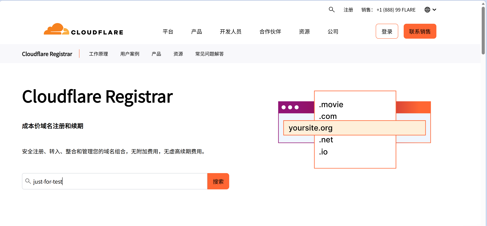

然后点击搜索，就会看见一系列可供购买的域名。

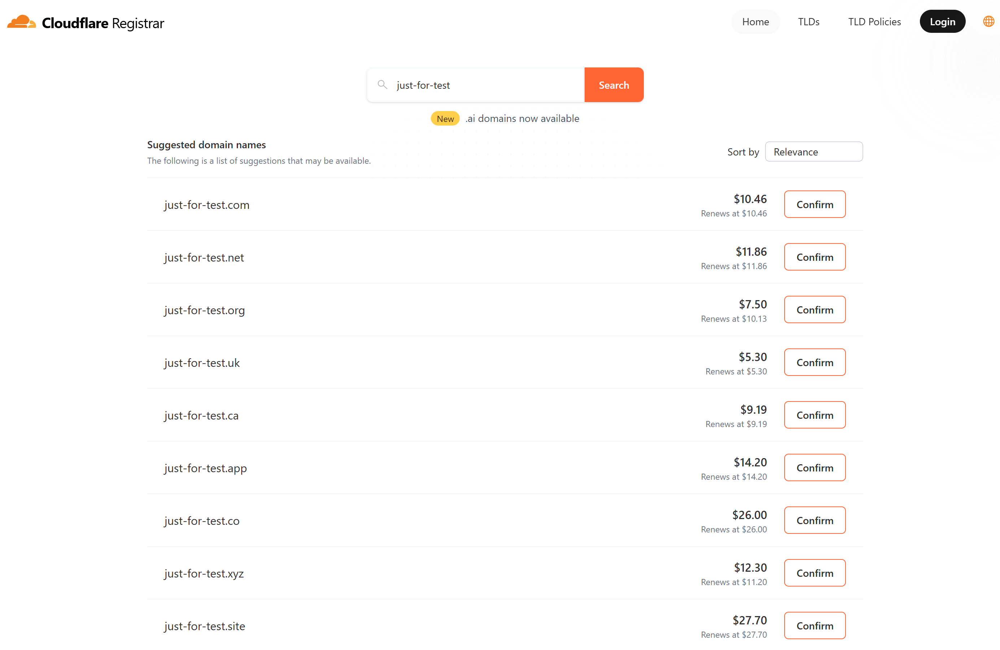

挑选你中意的域名（当然要价格合适的），点击右边的confirm，就会跳转到登录页面。在注册/登录cloudflare账号之后，就来到了付款页面。这里需要填写一些资料，不带星号的内容可以不填写。  

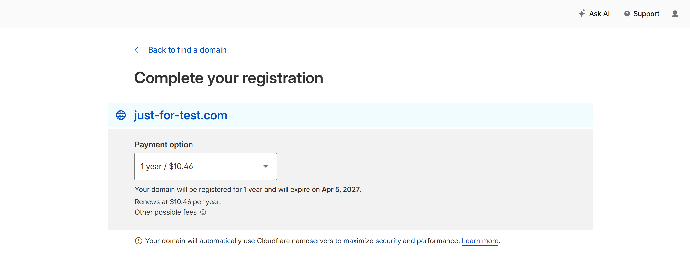

这里能看到价格是1年10美元，平均下来一个月一美元不到，童叟无欺。

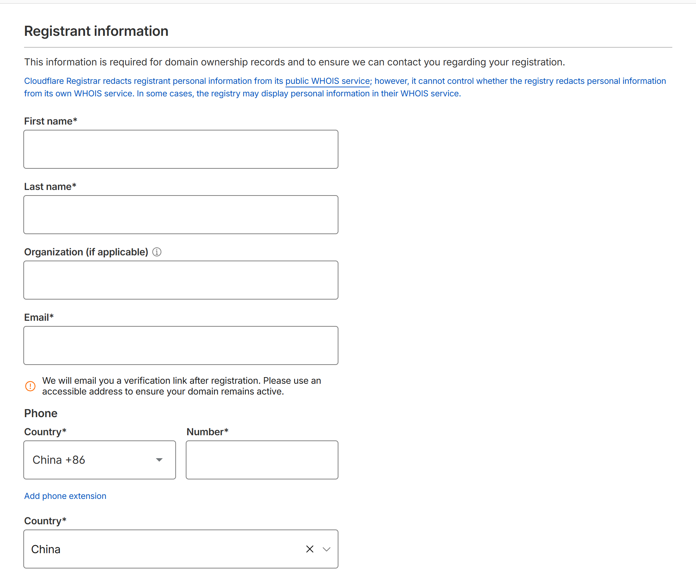

这里填china也可以通过。

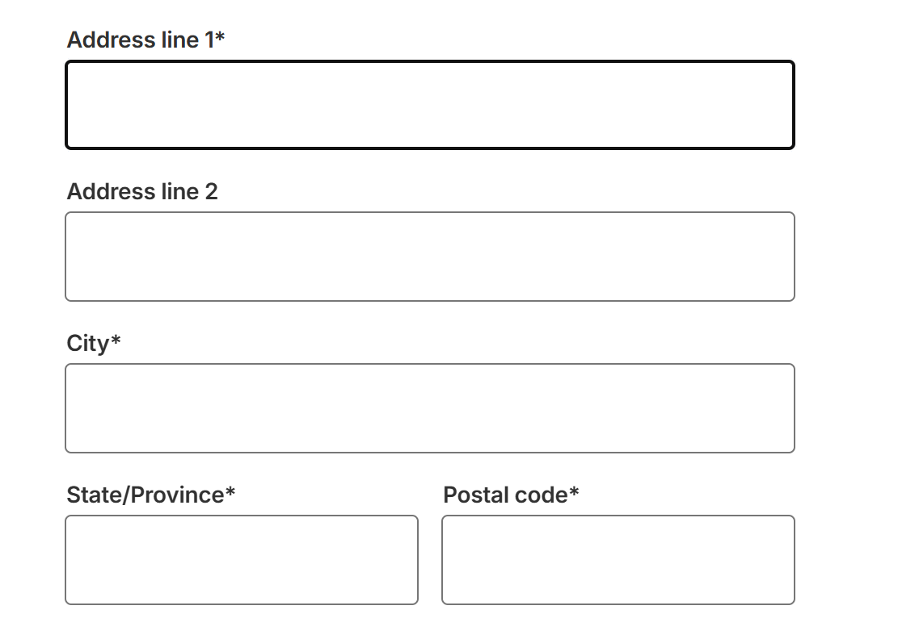

这里我填的是跟外币卡账单地址一样的地址。

在填写完**Registrant information**后，就要填写付款地址。这里我选择的是PayPal购买，也可以选择其他方式。  

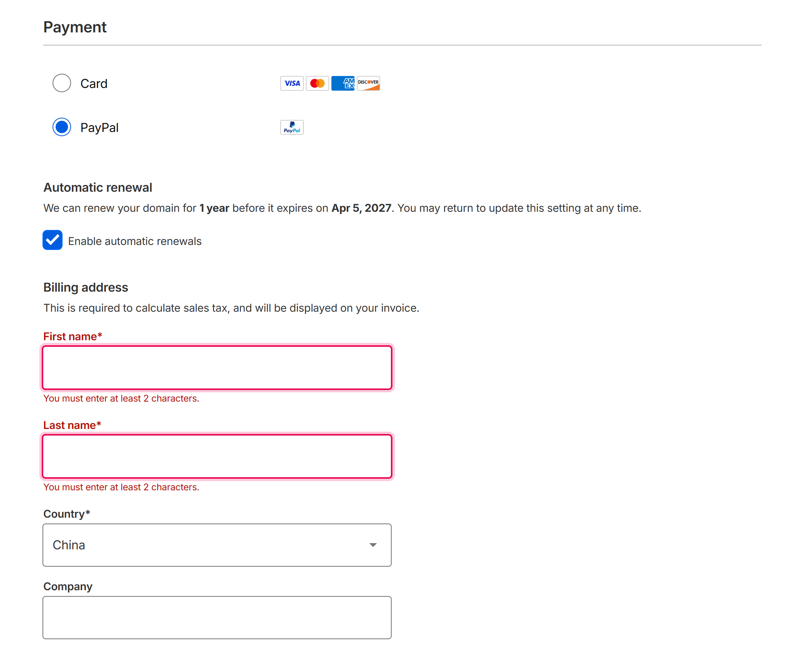

这里的Automatic renewal指的是自动续费，不想续费的话可以直接关闭。

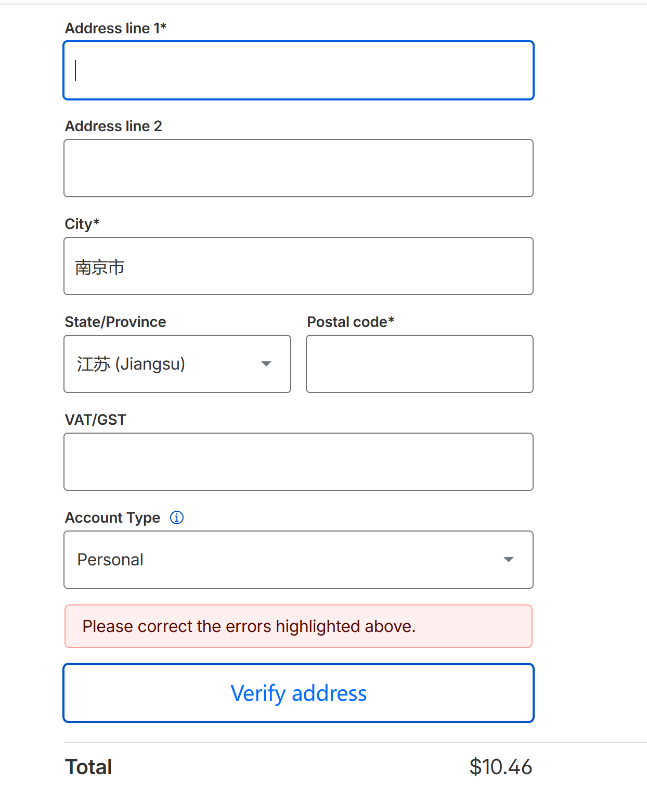

在填写完毕后，点击Verify address。验证结束之后，点击购买。

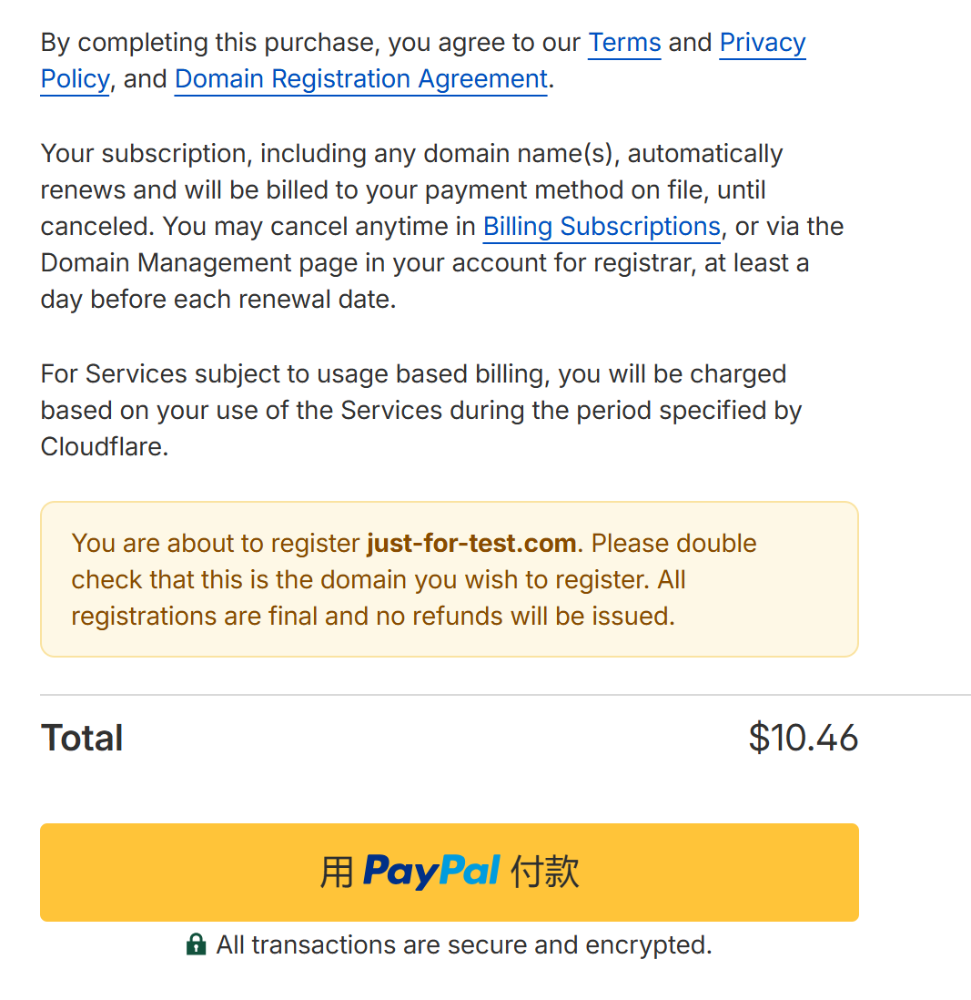

在付款结束之后，你就拥有了一个真正属于你个人的为期一年的域名！ヾ(≧∇≦\*)ゝ

### 1.3 解析域名

在获得了域名之后，我们就需要将域名与服务器的IP地址相对应。首先，我们进入Cloudflare官网：

[随时随地连接、保护和构建 | Cloudflare](https://www.cloudflare.com/zh-cn/)

登录之后，进入到账号管理界面。点击左侧侧边栏的domains/overview。再点击自己的域名，进入域名管理界面。

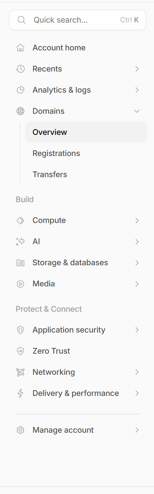

overview下面的就是Registrations，在这里可以注册域名，也能看到自己已经注册了的域名。

在域名管理界面中，点击DNS/Records。我们需要在 DNS 中添加解析记录，好让域名能成功指向我们的 IP 地址。

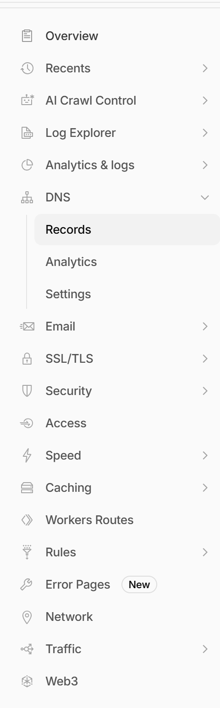

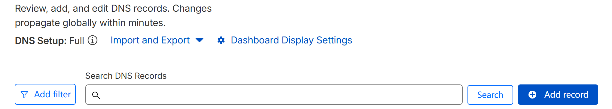

点击Add record

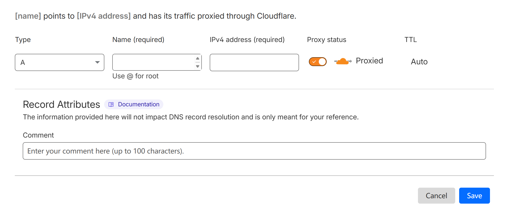

在这里输入域名与IP地址。如果要填IPV6地址，可以将Type换成AAAA。如果域名就是主域名，直接填入@即可。

然后点击Save。这样，你就成功将你的域名指向了你的IP地址。

当然，有细心的朋友肯定发现了，这里的Name好像不止能够填主域名，还能填很多次级域名。并且上方的\[name\]会自动变成Name+主域名的形式。

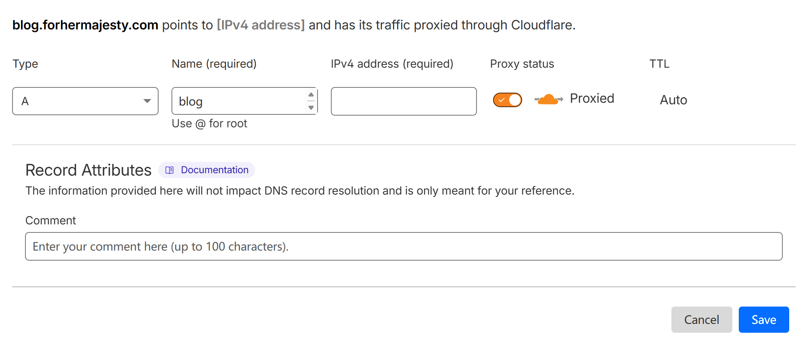

这里没有特殊需求的话不需要关闭Cloudflare的Proxy。

没错！拥有一个主域名之后，我们可以创建无数个次级域名。但是这时候有很多朋友可能会有疑问了：我们的IP地址不是只有一个吗？这么多域名指向同一个IP地址，不会发生错误吗？  
确实会发生错误，所以我们要接下来就要解决这个问题。

## 第二步：配置服务器反向代理  

反向代理指的是在在公网与内网之间搭建一个中转站，它负责代替后方的真实应用，接收所有外网访客的访问请求。随后，它会根据规则将请求精准分发给内网对应的服务器处理，并将结果代为返回给访客，从而对外隐藏并保护了内部真实的服务器。

与之相对的是正向代理，它是一种代理客户端发起网络请求的通信机制。在这种架构中，正向代理服务器部署在客户端与外部网络之间，客户端明确知道要访问的目标地址，但主动将请求发送给代理服务器，由其代替客户端向目标真实服务器获取资源并交还给客户端；该机制的核心作用是突破客户端的网络访问限制以及隐藏客户端的真实 IP 地址，使得目标服务器只能接收并记录代理服务器的访问信息，而完全无法感知底层真实发出请求的客户端节点。

简单来说，正向代理是在客户端--服务器之间隐藏客户端的信息，让被访问的服务器无法得知客户端的信息；反向代理是在客户端--服务器之间隐藏服务器的信息，让访问服务器的客户端无法得知背后真正处理业务的服务器的具体内网 IP 和架构，只能知道服务器的公网IP和域名。

### 2.1 前置条件

在此处，我建议下载一个finalshell连接上服务器，然后在服务器中下载安装1panel并且进行配置。注意不要下载盗版网站的文件，这里提供了FinalShell的正版网站。关于finalshell的下载与使用，可以参考：

[FinalShell官网](https://www.hostbuf.com/)

[FinalShell的使用及简介 - 一统天下。 - 博客园](https://www.cnblogs.com/yitongtianxia666/p/17591253.html)

在下载完成后，进入FinalShell 的终端，运行 1Panel 官方的一键安装脚本：

```shellscript

curl -sSL https://resource.fit2cloud.com/1panel/package/quick_start.sh -o quick_start.sh && sudo bash quick_start.sh
```

运行后，脚本会自动配置 Docker 环境。安装过程中会要求你设置面板的端口、用户名和密码，请务必记下这些信息。  
安装过程中如果网络中断，可以重新运行上述脚本；默认的安装目录为 \`/opt/1panel\`。  
安装完成后，在浏览器输入 http://服务器IP:你设置的面板端口，输入账号密码登录 1Panel 面板。

### 2.2 配置服务器

首先我们需要开放服务器的80端口（HTTP协议的标准默认端口）与443端口（HTTPS协议的标准默认端口）。在1panel中点击系统/终端。在终端中输入：

```shellscript
iptables -I INPUT -p tcp --dport 80 -j ACCEPT
iptables -I INPUT -p tcp --dport 443 -j ACCEPT
```

在服务器提供商的防火墙处也要开启这两个端口。这里提供Oracle的防火墙开启路径：

_进入Oracle主页--点击实例--点击你的服务器--下滑找到虚拟云网络并进入--点击安全，进入安全列表中的Default Security List--点击安全规则。在这里编辑入站规则即可。_

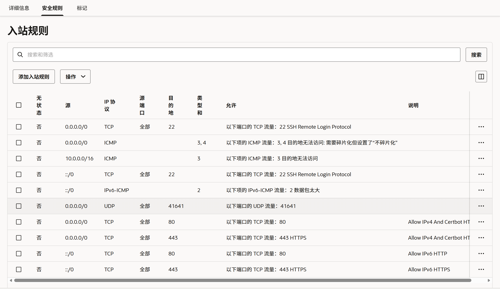

然后进入1panel界面，点击应用商店，搜索并且下载mysql、nginx-proxy-manager（NPM）、halo。参数配置部分默认即可。Halo的外部访问地址填写域名（主域名跟次级域名均可）。

### 2.3 配置NPM

这里由于我们没有在对外网开放NPM的管理端口（默认为81），仅仅将宿主机的端口号（默认为81）映射到了管理面板的端口上，所以无法直接通过IP+端口号访问NPM的管理面板。

我们先打开本地终端。如果是windows系统用户，在终端中输入：

```shellscript
ssh -i "你的vps_key.pem的路径,如：C:\Users\你的用户名\.ssh\my_vps_key.pem" -L 8081:localhost:81 root@你的VPS公网IP
```

如果是Mac / Linux系统用户，则输入：

```shellscript
ssh -i 你的my_vps_key的路径,如：~/.ssh/my_vps_key -L 8081:localhost:81 root@你的VPS公网IP
```

验证成功之后，我们就通过ssh建立了加密隧道连接到了我们的服务器，并且将本地的8081端口映射到了服务器的81端口。由于服务器的81端口映射到了NPM管理面板的端口，所以我们访问本地的8081端口就能直接进入NPM的管理面板。我们在浏览器中输入 http://127.0.0.1:8081，这时会发现我们进入了NPM的管理面板。初次登录需要自己设置账号密码。

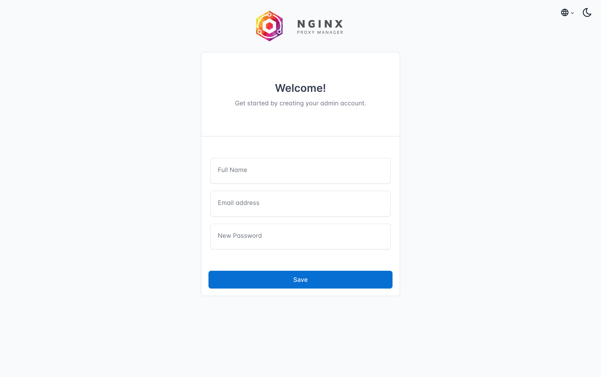

进入之后，点击Certificates，然后点击add certificate/Add Let's Encrypt via HTTP。

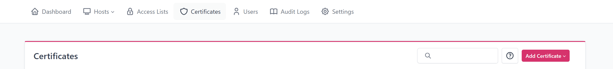

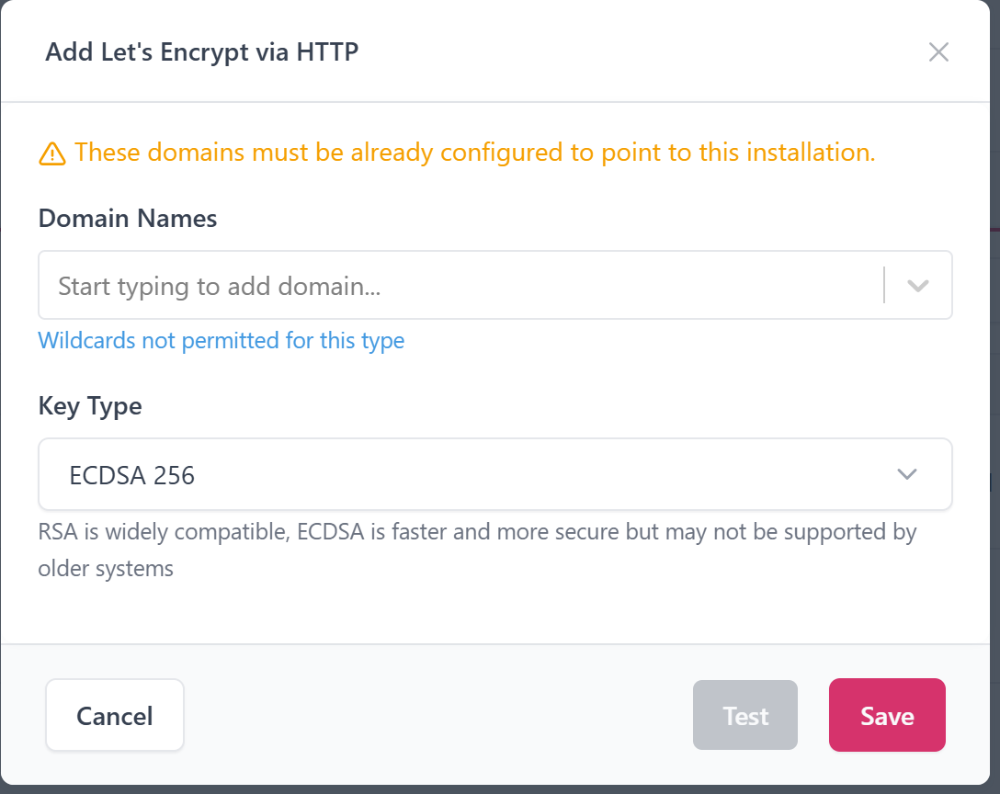

这里输入你想要为Halo配置的域名，然后点击Save。

在拿到一个Certificate后，点击proxy hosts。然后点击add proxy host。

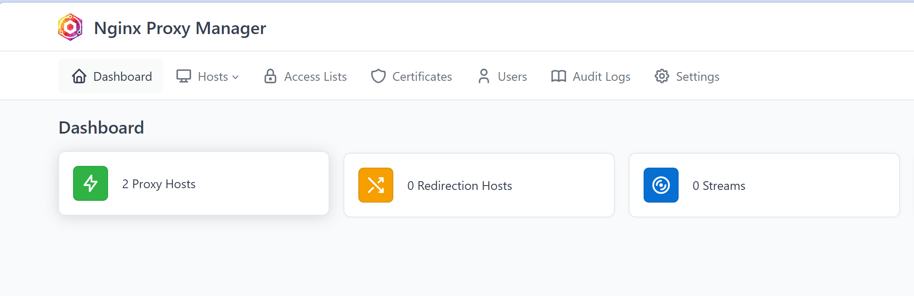

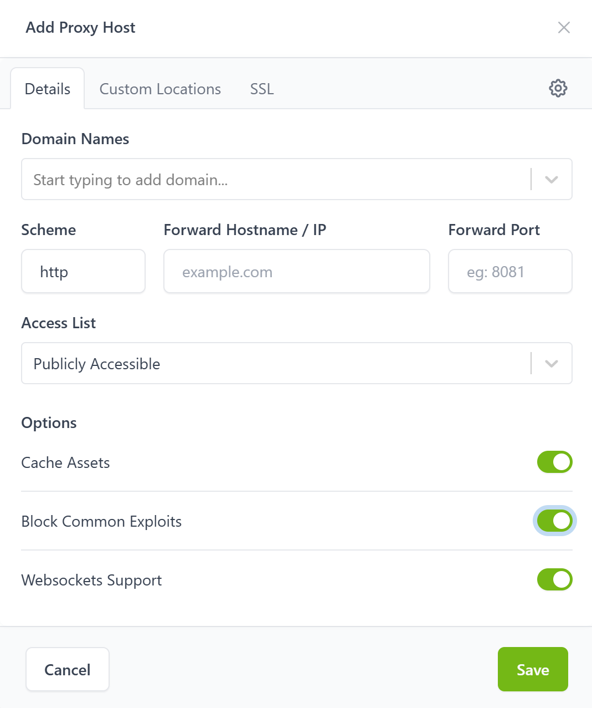

这里第一个空填写你想为Halo分配的域名，第二个空填写Halo的容器名，第三个空填写Halo的端口号。具体可以在1panel的容器中查看。

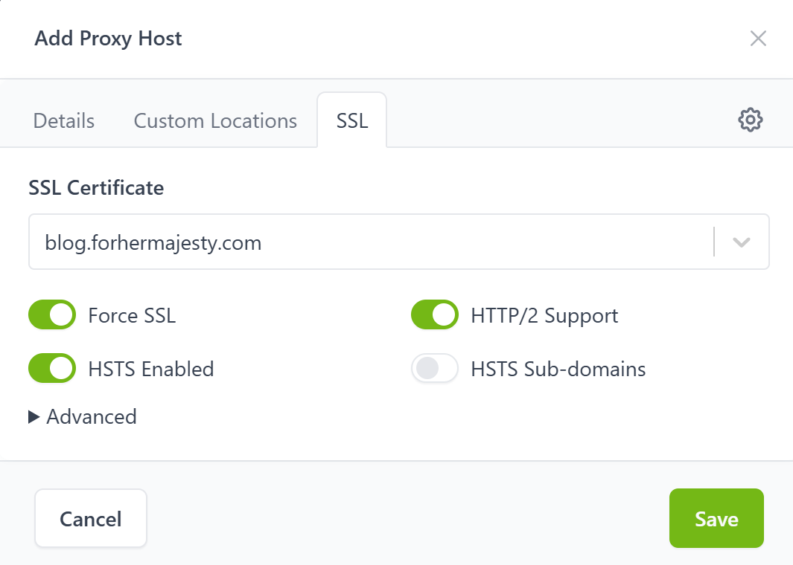

这里第一个空选择刚才生成的Certificate。

然后点击Save。之后，你在浏览器中输入你为Halo分配的域名，就能进入你的个人博客了！:阿鲁\_脸红:

如果你之后想要直接访问NPM管理面板的话，也可以按照上面的流程为管理面板分配一个域名（这时Forward Hostname填写127.0.0.1即可）。

当然，做到这里可能有朋友还是似懂非懂：这样做如何能解决之前提出的多个域名但是只有一个IP地址的问题呢？答案如下：

平常通过浏览器访问没有加端口号时，浏览器会默认走80或443端口。通过NPM，我们可以将所有访问443端口的流量根据不同的域名转发到不同的端口号，而每一个端口号都代表着一个应用。所以现在不再是多个域名对应一个IP，而是多个域名对应一个IP下的多个端口号！

并且这样设置不需要将其他应用的端口号暴露在公网上（暴露在公网意味着他人能够通过IP+端口号访问），只需要暴露浏览器正常访问的80/443端口，这样也更加安全。

至于为什么主要处理 443 而不转发 80 端口的流量，是因为 80 端口（HTTP）是以明文传输数据，极不安全；在实际应用中，我们通常只会让 NPM 把所有 80 端口的访问请求，强制跳转到加密的 443 端口（HTTPS）上，再进行安全的统一分发。

## 第三步：配置Halo网站

### 3.1 Halo初始化

这里Halo提供了详尽的文档，可以直接阅读Halo的文档。

[初始化 | Halo 文档](https://docs.halo.run/getting-started/setup)

在访问Halo的域名之后，我们进入了Halo网站。在首次访问网站的时候会自动跳转到初始化页面，你需要完成这个步骤才能正常使用 Halo。


表单项说明：

1.  **站点标题**：网站的名称，将会显示在浏览器标签页上。
    
2.  **用户名**：初始管理员的用户名。
    
3.  **电子邮箱**：初始管理员的邮箱地址。
    
4.  **密码**：初始管理员的密码。
    
5.  **确认密码**：重复输入密码以验证是否匹配。
    

输入完成之后点击**初始化**按钮即可完成初始化，初始化完成之后，将会跳转到登录页面，输入刚才设置的用户名和密码即可登录。

### 3.2 Halo主要功能介绍

输入域名/console，会进入到Halo的控制面板界面。左侧的侧边栏是一些会用到的功能。

首先是附件，这里存放着在Halo中写文章会用到的文件。默认的存储策略是本地存储（指的是服务器本地），可以通过下载插件来增加其他的存储策略，实现云端存储功能。如果在文章中用到了文件，文件会自动保存到本地存储。

然后是页面，页面是独立于博客文章列表之外、没有时效性与分类的静态网页，专门用于承载像“关于我”、“留言板”或“友情链接”这类常驻在导航栏的固定内容。比如：

-   **关于我（About）：** 介绍博主是谁。
    
-   **留言板（Guestbook）：** 提供一个固定的地方让访客留言。
    
-   **友情链接（Links）：** 展示你和其他博主的友链（Halo 的很多主题都有专门的友链页面模板）。
    
-   **作品集（Portfolio）：** 展示你的开源项目或设计作品。
    

等等。

然后是文章，这里你可以写文章，展示到你的主页中。可以通过右上角的设置为文章设置：分类目录、标签、封面页等。

然后是评论，这里可以看到别人的评论。

然后是商店部分。如果用的不是付费版的Halo可以直接略过不管。

然后是主题，主题处可以自由定义你的博客页面，也可以通过点击右上角的主题管理/侧边栏的应用市场下载主题。

菜单部分可以管理你的博客页面最上方的菜单栏。就像这样。也可以通过下载插件配置更丰富的菜单项。


插件部分可以下载你想要下载的插件。下载完之后记得启用。在插件管理页面直接点击插件名字会跳转到对应插件的设置页面。

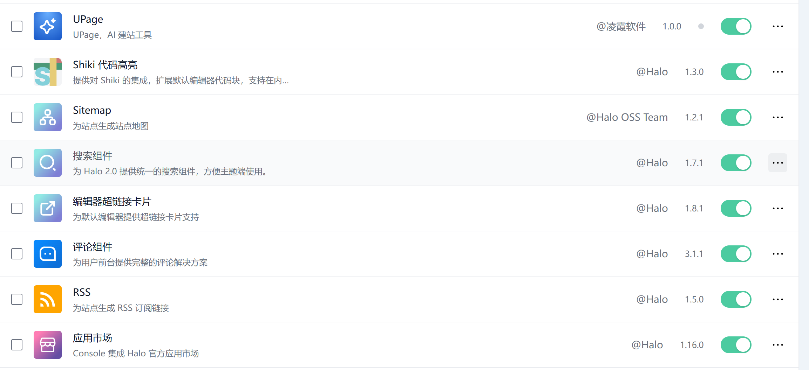

这里点击搜索组件，就会跳转到搜索组件插件的设置页面。

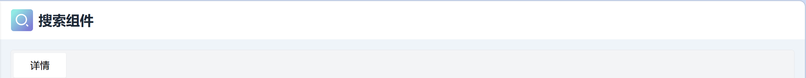

用户部分可以管理在你的网站注册的用户。

设置部分内容较多，需要自己去探索。这里只介绍基础设置部分。在基础设置部分可以设置站点标题/副标题；Logo（显示在博客页面的图标）；Favicon（显示在浏览器中的网站图标）。

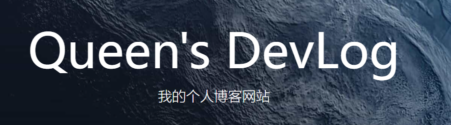

上面是站点标题，下面是副标题。

然后是概览、备份。不怎么用得到。

然后是工具。下载插件可能会在此处增加一个对应的工具。

在应用市场内，可以下载主题/插件。

教程到这里大概就结束了。Halo内还有很多有趣的功能，欢迎大家自行探索！
